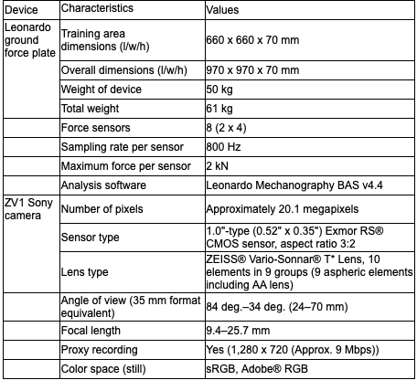
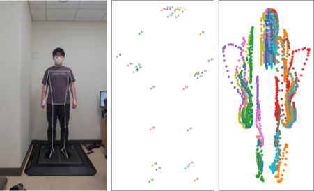

# Video-estimated peak jump power using deep learning is associated with sarcopenia and low physical performance in adults
Code for "Video-estimated peak jump power using deep learning is associated with sarcopenia and low physical performance in adults" The underlying code will be made available soon.

## Video clip processing
The videos captured the participants from the moment they stepped onto the jump force plate until they left it. Each video included three single jumps. All videos were manually edited to show each jump in a two-second clip at a rate of 120 frames per second. These video clips were then synchronized with the corresponding jumping mechanography parameters for each jump. Given the practical challenges of manually cropping each video to two seconds, we have developed an automatic jump motion detection system. For each jump, a movement is considered a jump if there's a displacement exceeding a certain threshold (3 pixels) from the initial point, with the direction of the movement being noted. Considering the counter movement that occurs just before the jump, movements in the negative direction (downwards) are captured to predict the timing of the jump.

     

*Description of device characteristics*

## Landmark extraction
We utilized MediaPipe (https://developers.google.com/mediapipe), an open-source machine learning framework developed by Google, to extract 33 human landmark points from each frame of the jump video clips. According to the website, MediaPipe is trained using the BlazePose model 12, which facilitates real-time body pose tracking on devices. For each clip, the model processed 120 frames, each containing 33 points. Despite MediaPipe’s overall performance in detection, we observed instability in frame-to-frame connectivity, resulting in jiggling points. To address this issue, a Kalman filter 13 was applied to every trajectory of the 33 points across the 120 frames for calibration. 

     

*Time-dependent trajectory of 33 pose landmark points detected by deep learning motion analysis (MediaPipe algorithm) in a two-legged vertical countermovement jump video clip*

## Jump parameters calculation
The filtered points were calculated for speed, acceleration, force, and power based on the movement of each point. The results calculated for 33 points were then aggregated on a patient-by-patient basis. The underlying methods will be made available soon.